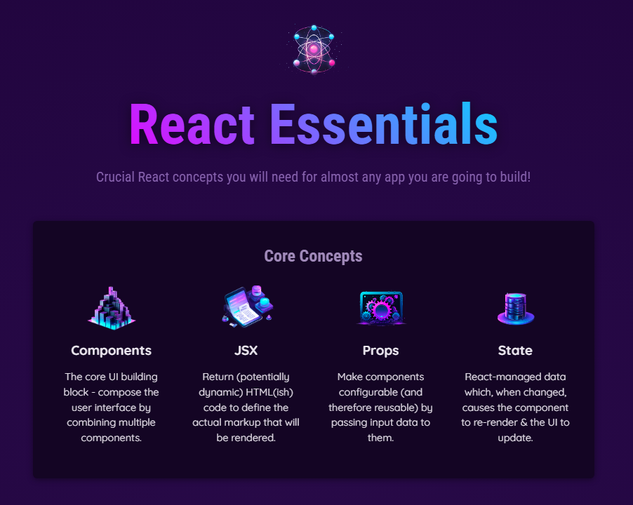
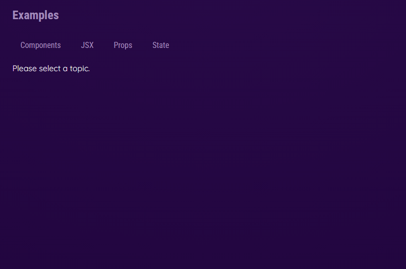
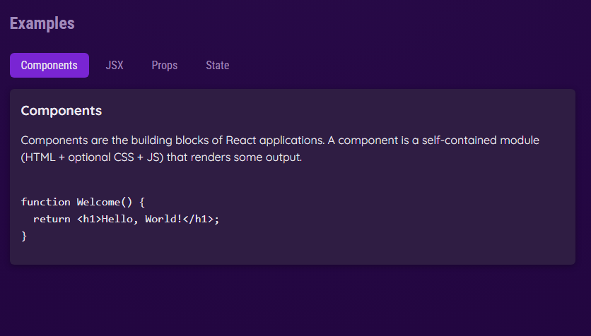
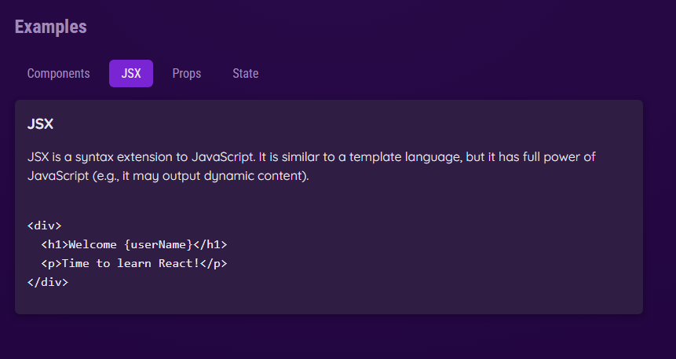
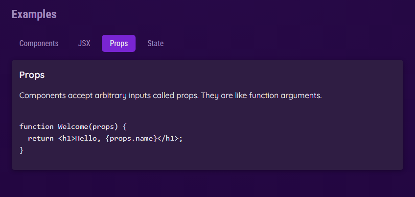
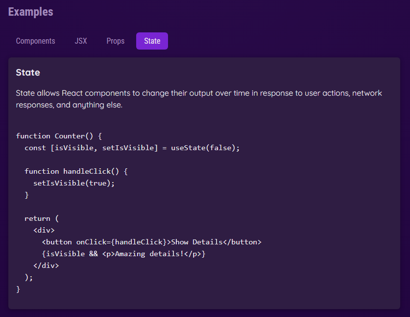

# Project: React Essential

Currently, two official plugins are available:

- [@vitejs/plugin-react](https://github.com/vitejs/vite-plugin-react/blob/main/packages/plugin-react) uses [Babel](https://babeljs.io/) (or [oxc](https://oxc.rs) when used in [rolldown-vite](https://vite.dev/guide/rolldown)) for Fast Refresh
- [@vitejs/plugin-react-swc](https://github.com/vitejs/vite-plugin-react/blob/main/packages/plugin-react-swc) uses [SWC](https://swc.rs/) for Fast Refresh

### Step 1: Add Component
- #### In React, the Component is just a Javascript function with 2 rules
  - Name must start with uppercase character & multi-word should be written in PascalCase (e.g., MyHeader)
  - Returns a renderable content (In most cases: Return JSX, but also returns: string, number, boolean, null, array of allowed values.)
- #### **Task 1:** Create a component with name "Header" having `, <h1>, 
` & Style all the 3 builtin components.

### Step 2: Dynamically loading the Content
- #### Instead of just outputting static content, we can actually output Dynamic content in a Component (JSX) by using curly braces {}.
- #### **Task 2:** We want the static content "Fundamental" in `<header>` to keep randomly changing with values as ['Core', 'Crucial']

### Step 3: Dynamically loading the Image
- #### **Task 3:** Import the image via 'import' & adding it to src via {}

### Step 4: Props Concept
- #### "Props" concept is all about passing the data/attributes (called as Props) into Custom Components & then use that data/attributes to built-in components.
- #### Component function can accept only one "prop" parameter & "prop" will be set by React becoz only React will execute this function.
- #### **Task 4:** Read data.js & pass the prop to created CoreConcept component, each having different title, description & image. Also style the CoreConcepts & all tags
- #### **Note:** We will get an error if we don't add `key` attribute to the list as it will be used by React. `Key` needs to be unique for each entry.

---

### Step 5: Component Composition
- #### Component Composition is a way of building Components where our components can wrap other Components/Contents.
- #### The "children" prop contains whatever content b/w our Component tag & this content can be text or some complex JSX structure if needed.
- #### Task 5: Add new section "examples" with `<h2>, 
 & <menu>` tag. Create a TabButton component with "children" prop & create 4 instances of TabButton having values/content as Component, JSX, Props, State. Style them too.

---

### Step 6: Reacting to Events
- #### The builtin components like `<button>` etc. support many `on{something}` props to listen variety of events. 
- #### The assigned value for any event props is a function (event handler) that will be executed when event occurs/triggers.
- #### **Note:** 
  - #### Function as value i.e., function without parenthesis () needs to be passed to the `onClick` prop. This function should not be executed by us (in case we add parenthesis) but instead by React when click on button occurs at some point in the future.
  - #### Advantage of defining these event handlers inside the component function is that they have access to the Component's Prop & State.
- #### **Task 6:** Add Event listener prop & handler function to TabButton & print "Clicked" on each click to TabButton.

### Step 7: Managing States
- #### State concept is all about registering variables that are going to be handled by React i.e., any change to the state of variable will be taken care by React.
- #### By default, React Components execute only once i.e., when loaded 1st time in the browser. We've to tell React explicitly that a particular Component should execute again when there is some state changes in the Component.
- #### For above, React provides special functions called "Hooks" that must be imported from React lib to create these special variables. E.g., `import { useState } from 'react'`;
- #### **Task 7:** On each tab button clicked, specific tab data should be displayed. Read examples from data.js for the selected tab.

#### **Heads up for Task 7:**
- #### Since the `App` component has both `TabButton` & `TabContent`, we need to manage a state in `App` component that will depend on the `TabButton` click and based on this state and tab identifier, the `TabContent` will be rendered.
- #### Since we're managing state in `App` component & the state changes on `TabButton`, then we will have to pass the Event Handler function from `App` component to `TabButton` component for its handling `onClick` event
#### Concepts covered as part of Task 7:
1. #### Passing Event function from Custom Component
   - #### To show dynamic content on the button click, we must handle the events on the Custom Component. Custom Components in the end just wraps Native HTML element/JSX element (to be precise the built-in components provided by React)
   - #### To set the value for the event-handler props on the built-in component from our Custom Component, we've to pass these props (function as value)  from our Custom Component to built-in component & React will make sure the function we provide as value will get triggered.
   
2. #### Passing Custom Argument to Event Handler Function
   - #### To differentiate which Tab button is clicked, we need an identifier or value on the respective tab button clicked.
   - #### By passing Arrow/Anonymous function as value to onSelect prop, we can control how `handleSelect()` function will be executed by React.
   - #### Then we can write the specific custom logic inside the arrow function body that will be executed when Anonymous func will be executed by React.

3. #### Computed/Derived values based on the State Change
    - #### This concept is about using the state variable, we compute or derive some values/logic
    - #### E.g., Loading of Tab Content based on the specific tab button selected.
   
4. #### Rendering Content Conditionally
    - #### This concept is about loading the content conditionally.
      - #### `selected === undefined or !selected`: To check if it's not truthy
      - #### Outputting null in JSX code will lead to nothing being rendered.
    - #### There are 3 ways to render the contents conditionally:
      1. #### Ternary Expression ( `condition ? true_statement : false_statement` )
      2. #### Using `&&` (logical AND) Operator
      3. #### Using variable to store the conditional render JSX code

### React Hooks
- #### React Hooks are technically regular functions, following below 2 rules:
  1. #### React Hooks name must start with `use`
  2. #### They should only be called from inside the React Component functions or inside other React Hooks. Must not be called from inside the nested function i.e., Top-level in the Component.

### useState() Hook
  - #### useState() hook allows us to manage Component specific states i.e., any change in the data stored by React in the Component, will trigger the Component complete function to be re-executed & re-evaluated by React.
  - #### It accepts default value as argument that will be used by React when the Component will be rendered first time & returns an array of exactly 2 elements:
    1. #### Element 1: Current data snapshot i.e., variable/const initial value when component was executed.
    2. #### Element 2: A setter function to update the current data snapshot with new value or state, accordingly React will re-execute the Component function
       - ####  Convention: Element2 should start with set{1st letter Uppercase}Element1 e.g., `const [initialValue, setInitialValue] = useState('Initial val');`

### How State Change works ?
- #### When we add the logic in setter function of useState() hook, React will schedule the state update **(i.e., not immediately state will be updated)** and then re-executes the Component function. So, the updated value/state will not reflect immediately but once the main component function re-executes.

---

### Step 8: CSS Dynamic Styling
- #### We can add styling based on the event.
- #### In regular HTML, we use `class` attribute but in React (JSX Specific), we use `className` attribute to the elements. Other attributes in JSX like "id" & so on are same as in HTML.
- #### **Task 8:** Highlight the Tab Button clicked by using inbuilt "active" class.

---