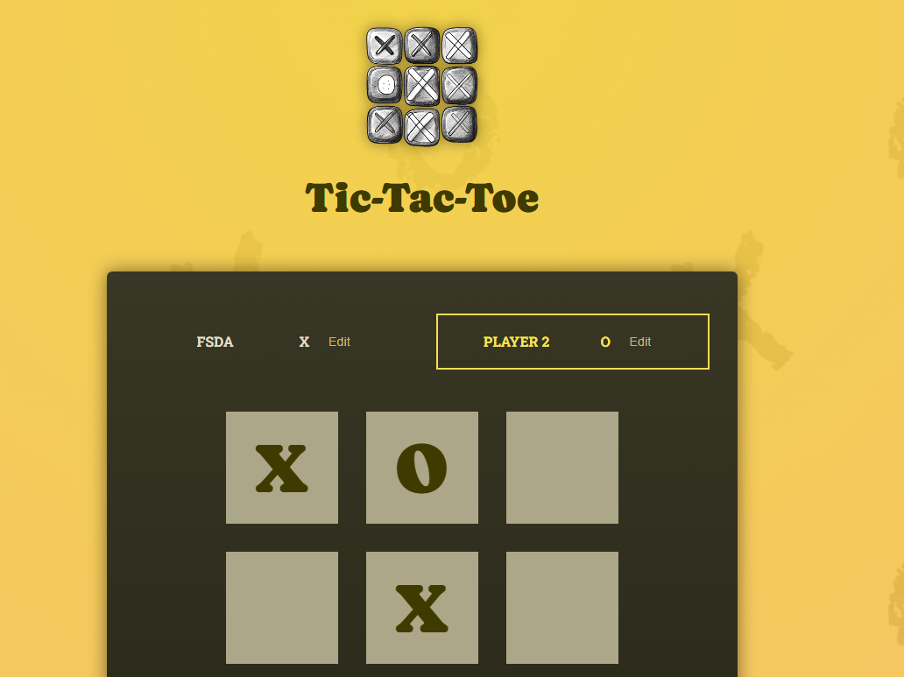
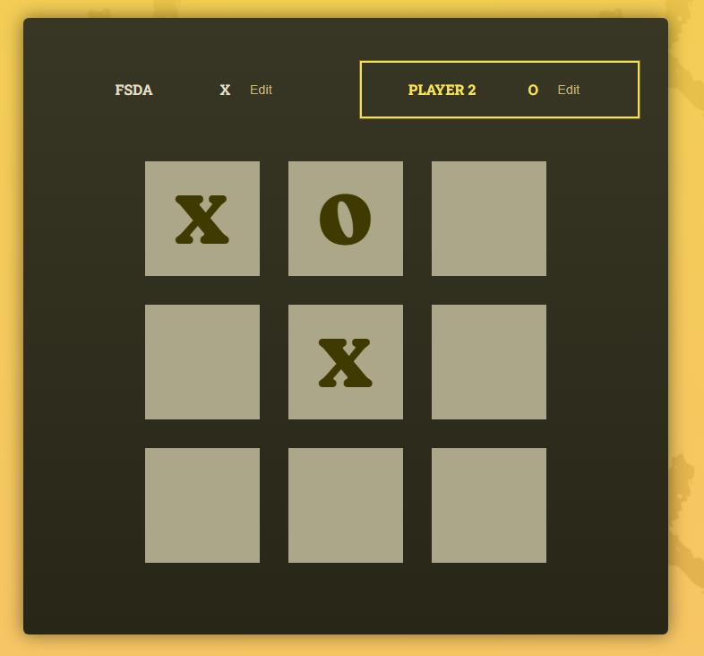
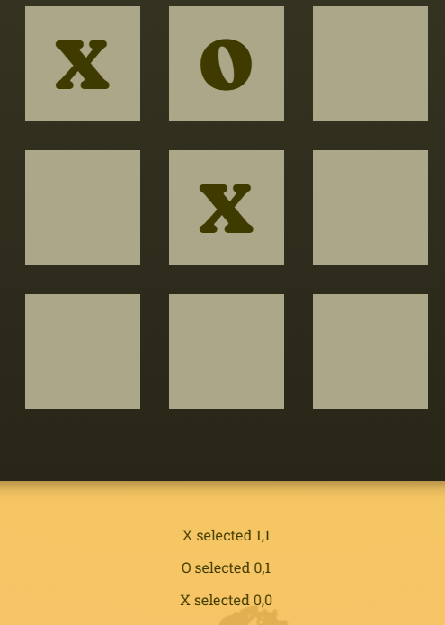
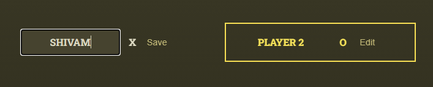

# Project: Tic Tac Toe 

Currently, two official plugins are available:

- [@vitejs/plugin-react](https://github.com/vitejs/vite-plugin-react/blob/main/packages/plugin-react) uses [Babel](https://babeljs.io/) (or [oxc](https://oxc.rs) when used in [rolldown-vite](https://vite.dev/guide/rolldown)) for Fast Refresh
- [@vitejs/plugin-react-swc](https://github.com/vitejs/vite-plugin-react/blob/main/packages/plugin-react-swc) uses [SWC](https://swc.rs/) for Fast Refresh

### Step 1: Not All Content must go into Components
- #### While working with React, we easily forget that we can add elements in index.html & we don't have to put everything into the Components.
- #### Ofc most of our web app's markup, logic will be going to Components but if we've some static markups like headers etc. that doesn't depend on any data or state, we can put them in index.html file.

### Step 2: public folder files
- #### By default, the files (img etc.) in public folder, will always be available to our website visitors & can easily reference those files inside our markup (no matter in component or index.html) by simply specifying the file name we want to use.
- #### No need to build the path for public folder files.

### Which folder should we use ?
1. #### public/ folder files
    - #### We should use the `public/ folder` for any images that should not be handled by the build process & that should be generally available.
    - #### Good candidates are the `images used directly in the index.html` file or `favicons`.

2. #### src/folder (e.g., src/assets/ )
    - #### On other hand, images that are used inside of components should typically be stored in the src/ folder (e.g. in `src/assets/`)

#### Task 1: Add `<header>` component with image in index.html & style the header & its content.

#### Task 2: Add the components: `Player`, Style it. 

#### Task 3: Add `input` on `edit` click & style it.

### Two-way Binding
- #### Listening to a change on the input & then feeding that updated value back into the input (via "value" prop) is called 2-way-binding.

#### Task 4: Utilizing 2-way binding, update the playerName via input event handler prop `onChange`
- #### `onChange` will be triggered for every keystroke & it will provide us with an event object that contains the value that was entered by the user.
- #### React will call the handleChange() function when the change event occurs & React will give us such an event object as a function.

---

