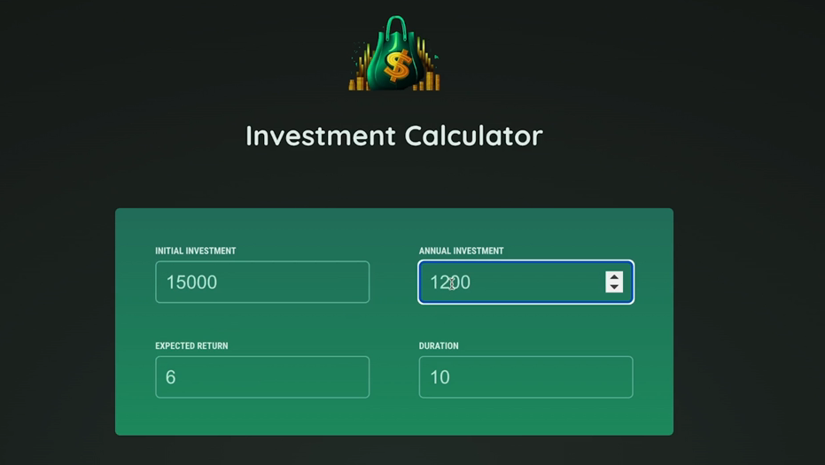
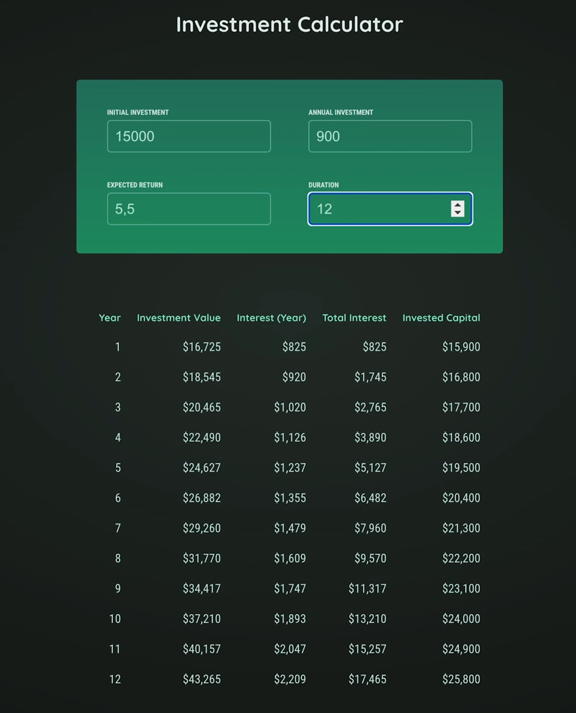

# Project: Investment Calculator

#### Task 1: Add Components for displaying a header with logo & title and style them

---

#### Task 2: Add Components for fetching user input & outputting the result table

---

#### Task 3: Output the userInput value by handling the `onChange` event and managing the `userInput` state via 2-way-binding

---

#### Task 4: Move the `userInput` state up from `UserInput` component to `App` component.
#### Heads up:
- #### Since we're planning to have a separate component for Outputting the result table, it makes sense to state up to `App` component.
- #### i.e., we'll need to move our userInput from the `UserInput` component to `App` component & pass the userInput state to `Results` component.

---

#### Task 5: Use investment.js to calculate the result to be displayed in the table in `Results` component.
- #### Note: In JS, even though we set input type="number", the event.target.value will always output string value.
- #### So for calculating investment, we will get invalid or concatenated values.
- #### Solution: Add + while setting the userInput e.g., [inputIdentifier]: +newValue
- #### + will force the conversion of string value to a number value.

---

#### Task 6: Output the `Result` component conditionally in case we've valid inputs.

---

