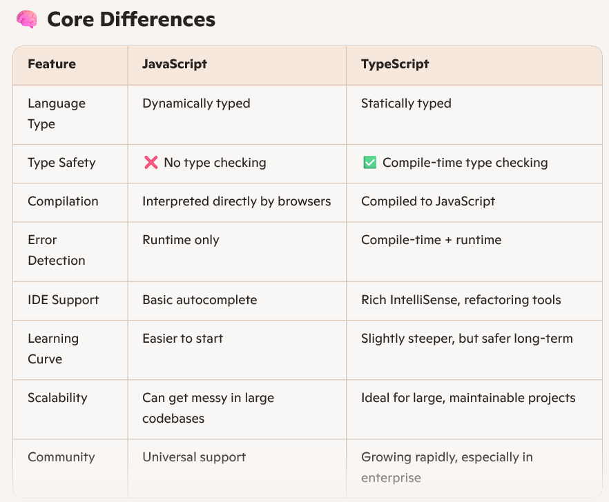
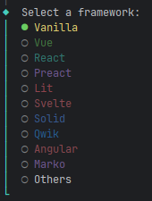
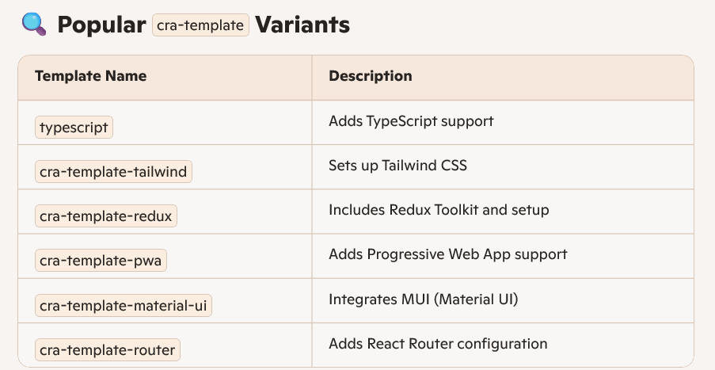

# JavaScript Vs TypeScript

# React Template patterns

## Using vite
- ### npm create vite@latest {project-name}
  - #### This will provide choices to select from.
    

- ### npm create vite@latest {project-name} -- --template {template-name}

- ### npm create vite@latest {project-name} -- --template vanilla

- ### npm create vite@latest {project-name} -- --template vanilla-ts

- ### npm create vite@latest {project-name} -- --template react

- ### npm create vite@latest {project-name} -- --template react-ts

## Using create-react-app

- ### npx create-react-app {project-name}
  - #### npx create-react-app {project-name} --template cra-template

- ### npx create-react-app {project-name} --template {template-name}

- ### npx create-react-app {project-name} --template typescript

- ### npx create-react-app {project-name} --template cra-template-tailwind
